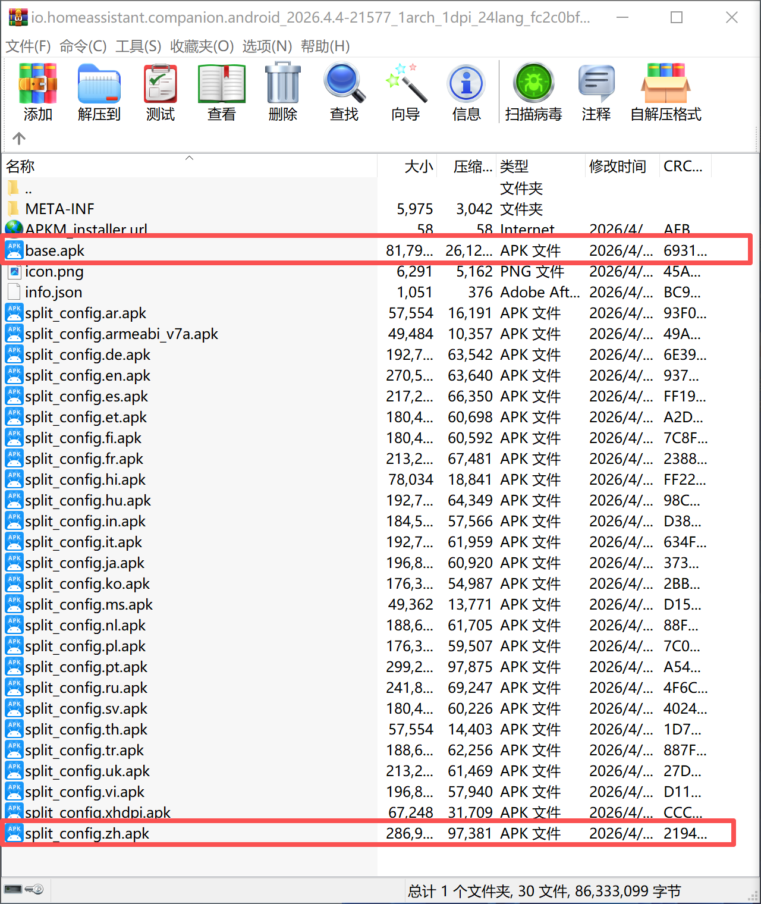
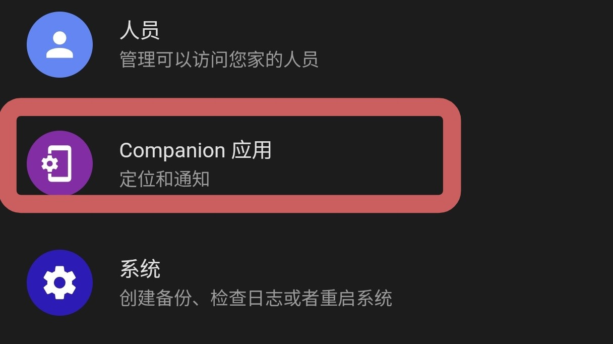
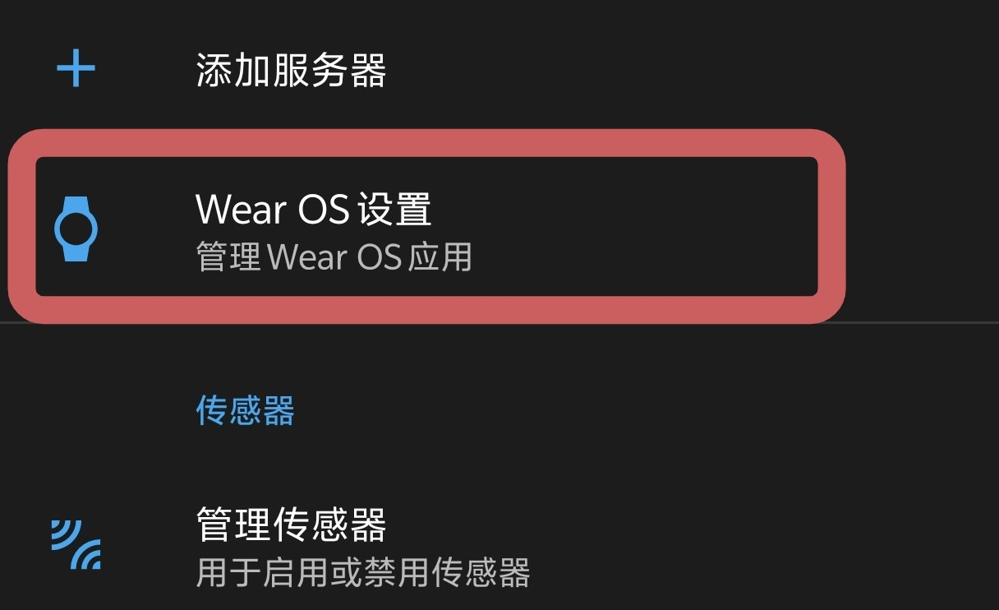
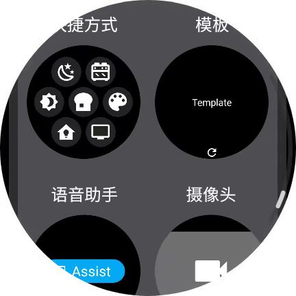
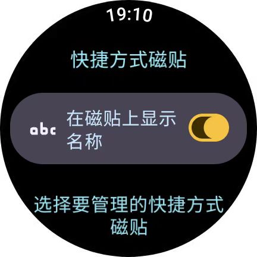
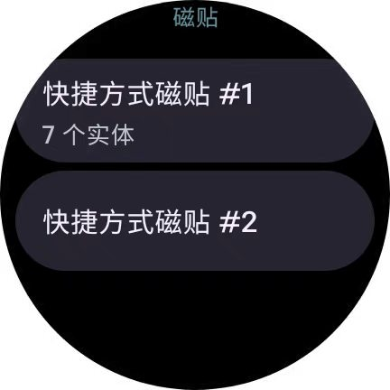
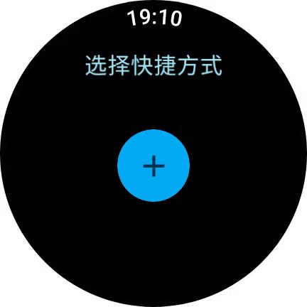
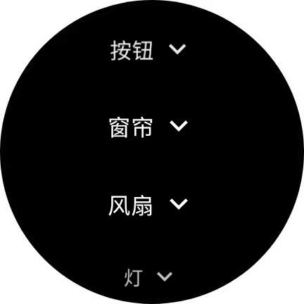
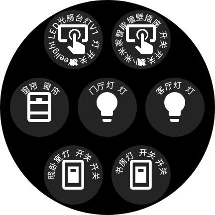

Home Assistant Companion 安装配置教程
=========================================
欢迎来到EdwardHX的技术教程分享。

家居市场的智能设备五花八门，用户往往会选择多个品牌的设备来打造智能家居系统，在本地部署自动化平台Home Assistant（HA）可让不同品牌设备实现跨平台协同工作。目前，如米家、homekit等智能家居平台已在移动可穿戴式设备上实现联动，但受限于各品牌的生态封闭性，三方穿戴设备只能通过如HA完成联动。本期教程将演示如何将HA子应用安装到运行Wear OS 6.0的国行Galaxy Watch 6 Classic上。

准备工作
----------------------------------------------
·`本地部署Home Assistant <https://bbs.hassbian.com/thread-18146-1-1.html>`_

.. warning::

   请根据部署设备类型选择对应的教程。

·在Android手机上下载并安装
`Home Assistant.apk <https://github.com/home-assistant/android/releases>`_

·输入分配给Home Assistant的ip和密码进行登录。

安装Home Assistant Companion 到 Wear OS 设备
----------------------------------------------
·国行Galaxy Watch无法从Google Play Store下载软件，所以需要从APK mirror下载
`Home Assistant Companion.apkm <https://www.apkmirror.com/apk/home-assistant/home-assistantm-wear-os/>`_

·将文件后缀.apkm更改为.zip。

·用解压软件打开zip，将base.apk和简中语言包split_config.zh.apk复制到手机。

    选中base.apk和split_config.zh.apk
    

·Apk mirror以apk bundles的形式提供文件，所以需要用adb指令安装split apks，本教程使用wear os工具箱（捐献版）进行安装。

·首先
`通过adb连接到工具箱 <https://help.wearosbox.com/connect/>`_
，连接成功后进入功能-安装 Split Apk-同时勾选base.apk和split_config.zh.apk-安装成功-启动手表上的HA。

·打开Android手机上的Home Assistant，进入-Companion 应用-Wear OS设置-登录Wear OS 设备-等待完成配置。

    Companion 应用

    Wear OS设置

·在Galaxy Watch上添加HA快捷方式卡片，然后回到HA Companion-快捷方式磁贴-勾选“在磁贴上显示名称”-选择快捷方式磁贴#1-添加常用设备。

    新增快捷方式磁贴

    显示设备名称，方便识别

    选择磁贴#1

    添加快捷方式

    添加常用设备

.. note::

   每一页卡片至多能添加7个快捷方式，如需添加更多，请创捷第二页卡片，并在快捷方式磁贴#2进行编辑。

   若HA Companion偶尔无法响应，请在手机端三星智能穿戴app里允许其后台活动。

    尽情享受便捷的控制方式吧！
